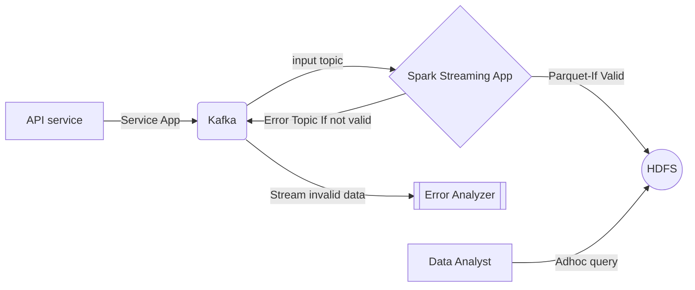

# Spark Streaming application

Spark streaming application that fetch data from Kafka(Mutual Fund pricing data) and write to Distributed File System - HDFS. Output data is encoded in parquet format and is partitioned based on Mutual Fund Family, Year, Month and Date as per the query requirement.

## Pre-requisites

- Apache Spark 3.2.0 scala 2.12 version
- Apache Kafka 2.13-2.8
- Java version "1.8.0_301"
- Apache Maven 3.8.2

## Steps

1. Clone the project
```
git clone https://github.com/nihadtp/nav_streaming_app.git
```

2. Build the project using maven inside the same directory

```
mvn clean package
```

3. Configuration for spark streaming is provided in a .conf file.

4. Make sure that Kafka Producer is up and running to feed this application with data. Refer this https://github.com/nihadtp/kafka_producer. And run the spark app as below

```
bash spark.sh
```

5. Go to localhost:4040 in your browser and click on Streaming Tab to see the real time data metrics - Processing time, Scheduling delay and Delay Time.

6. Go to the output path in the .conf file to see the output file written in real time with appropriate partitioning.

## Data Flow


