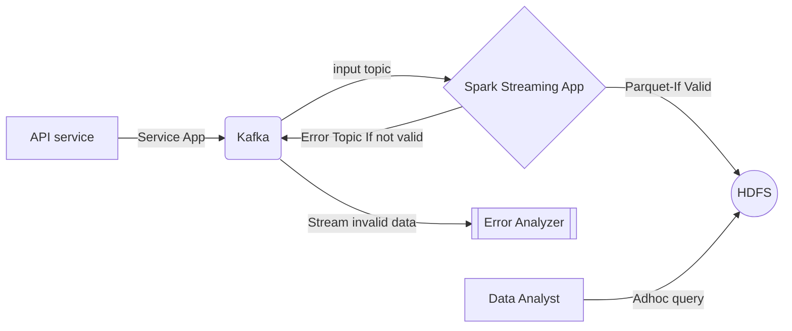

# Spark Streaming application

Spark streaming application that fetch data from Kafka(Mutual Fund pricing data) and write to Distributed File System - HDFS. Output data is encoded in parquet format and is partitioned based on Mutual Fund Family, Year, Month and Date as per the query requirement.

## Pre-requisites

- Apache Spark 3.2.0 scala 2.12 version
- Apache Kafka 2.13-2.8
- Java version "1.8.0_301"
- Apache Maven 3.8.2

## Steps

1. Clone the project
```
git clone https://github.com/nihadtp/nav_streaming_app.git
```

2. Build the project using maven inside the same directory

```
mvn clean package
```

3. Configuration for spark streaming is provided in a .conf file.

4. Make sure that Kafka Producer is up and running to feed this application with data. Refer this https://github.com/nihadtp/kafka_producer. And run the spark app as below

```
bash spark.sh
```

5. Go to localhost:4040 in your browser and click on Streaming Tab to see the real time data metrics - Processing time, Scheduling delay and Delay Time.

6. Go to the output path in the .conf file to see the output file written in real time with appropriate partitioning.

## Data Flow



### API service
We use a free API service from https://rapidapi.com/suneetk92/api/latest-mutual-fund-nav/.  A python service app is implimented to fetch large amount of API responses concurrently and feed them to a Kafka topic asynchrously. Data is fetched from 2008 to current data. After that, it is fetch incrementally on a daily bases. It is assumed that API service has no down time and failures.

### Kafka
Two topics created - Input for spark app and output for spark app. API service app is responsible for producing data for input topic. Spark app is responsible for producing data for output topic.

### Spark Application
Spark ingest data from kafka. Main operations performed are data validation, data transformation, data partitioning and data write to HDFS. Processes data in micro batches in every 5 seconds. We receive 4-8 records every second. Invalid data sent back to an error topic. Application is fault tolerant. It regularly commits offset asynchronously so that when application is failed or took down for upgradation we can always resume back from the last committed offset.

### HDFS
Output data is encoded in parqeut due to it's columnar storage. Since this is a OLAP transactions, query involving columns selections can be very fast. HDFS is scalable and can be partitioned based on keys. 